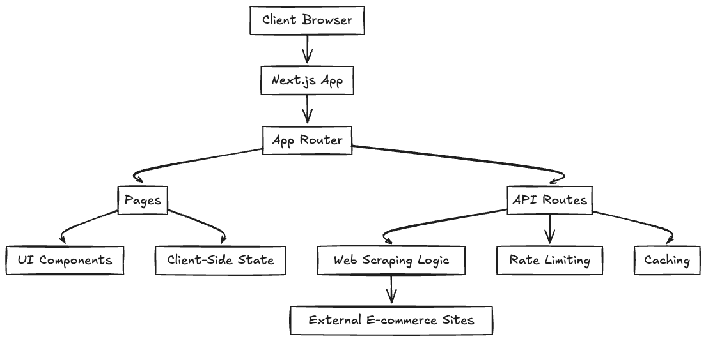

# Next.js E-commerce Price Tracker: Design Document

## Table of Contents

- [1. Architecture and Design Choices](#1-architecture-and-design-choices)
  - [1.1 Overall Application Architecture](#11-overall-application-architecture)
  - [1.2 Component Structure](#12-component-structure)
  - [1.3 Data Fetching Strategies](#13-data-fetching-strategies)
  - [1.4 Routing Mechanisms](#14-routing-mechanisms)
  - [1.5 State Management](#15-state-management)
  - [1.6 Design Patterns](#16-design-patterns)
  - [1.7 Rationale for Architectural Choices](#17-rationale-for-architectural-choices)
- [2. Tools and Libraries Used](#2-tools-and-libraries-used)
  - [2.1 Core Framework and Language](#21-core-framework-and-language)
  - [2.2 Styling and UI](#22-styling-and-ui)
  - [2.3 Data Fetching and Processing](#23-data-fetching-and-processing)
  - [2.4 UI Enhancement and Theming](#24-ui-enhancement-and-theming)
  - [2.5 Form Handling and Validation](#25-form-handling-and-validation)
- [3. Tradeoffs and Assumptions](#3-tradeoffs-and-assumptions)
  - [3.1 Technology Selection Tradeoffs](#31-technology-selection-tradeoffs)
  - [3.2 Feature Prioritization](#32-feature-prioritization)
  - [3.3 Performance Optimization Decisions](#33-performance-optimization-decisions)
  - [3.4 Assumptions](#34-assumptions)
- [4. Future Improvements](#4-future-improvements)
  - [4.1 Feature Enhancements](#41-feature-enhancements)
  - [4.2 Technical Improvements](#42-technical-improvements)
  - [4.3 UX Improvements](#43-ux-improvements)
  - [4.4 Infrastructure Improvements](#44-infrastructure-improvements)
- [5. Conclusion](#5-conclusion)

## 1. Architecture and Design Choices

### 1.1 Overall Application Architecture

The Next.js E-commerce Price Tracker is built using a modern, component-based architecture following the principles of the Next.js App Router. The application is structured to optimize for both performance and developer experience, with a clear separation of concerns between UI components, data fetching, and business logic.



Mermaid:
```shell
graph TD;
    A["Client Browser"] --> B["Next.js App"]
    B --> C["App Router"]
    C --> D["Pages"]
    C --> E["API Routes"]
    D --> F["UI Components"]
    D --> G["Client-Side State"]
    E --> H["Web Scraping Logic"]
    E --> I["Rate Limiting"]
    E --> J["Caching"]
    H --> K["External E-commerce Sites"]
```

### 1.2 Component Structure

The application follows a hierarchical component structure:

- **Page Components**: Top-level components that represent entire pages (`page.tsx` files)
- **Layout Components**: Components that define the layout structure (header, footer)
- **Feature Components**: Specialized components for specific features (price tracker form, product card)
- **UI Components**: Reusable UI elements from shadcn/ui (buttons, cards, inputs)

This structure promotes reusability and maintainability by encapsulating related functionality and UI elements.

### 1.3 Data Fetching Strategies

The application employs a hybrid approach to data fetching:

- **Server-Side API Routes**: Used for web scraping operations to fetch product data from e-commerce sites. This approach keeps sensitive operations and logic on the server.
- **Client-Side Fetching**: Used for communicating with the application's own API routes from the browser.

This hybrid approach provides several benefits:
- Protects scraping logic from being exposed to the client
- Enables server-side rate limiting and caching
- Allows for a responsive UI during data fetching operations

### 1.4 Routing Mechanisms

The application uses Next.js App Router for routing:

- **Static Routes**: Home page (`/`)
- **Dynamic Routes**: Product pages (`/[...productPath]`)
- **API Routes**: Backend functionality (`/api/track-price`)

The dynamic route pattern `[...productPath]` is particularly useful as it allows the application to handle various product URL formats from e-commerce sites.

### 1.5 State Management

The application uses React's built-in state management solutions:

- **Local Component State**: Managed with `useState` hooks for component-specific state
- **Form State**: Managed within form components with controlled inputs
- **Loading States**: Dedicated states to track loading, success, and error conditions

This approach was chosen for its simplicity and sufficiency for the current application scope. As the application grows, more sophisticated state management solutions could be considered.

### 1.6 Design Patterns

Several design patterns are employed throughout the application:

- **Component Composition**: UI is composed of smaller, reusable components
- **Container/Presentational Pattern**: Separation between data-fetching logic and UI rendering
- **Custom Hooks**: Encapsulation of reusable logic (e.g., form validation)
- **Error Boundaries**: Graceful handling of runtime errors

### 1.7 Rationale for Architectural Choices

- **Next.js App Router**: Chosen for its file-based routing, built-in API routes, and optimized rendering strategies
- **Component-Based Architecture**: Promotes reusability, testability, and maintainability
- **Server-Side Scraping**: Protects scraping logic, enables rate limiting, and avoids CORS issues
- **TypeScript**: Provides type safety and better developer experience
- **Tailwind CSS with shadcn/ui**: Offers a consistent design system with minimal CSS overhead

## 2. Tools and Libraries Used

### 2.1 Core Framework and Language

#### Next.js (v15.3.2)
- **Purpose**: Full-stack React framework for web applications
- **Integration**: Used as the primary framework for both frontend and backend
- **Benefits**: 
  - File-based routing
  - API routes for backend functionality
  - Built-in performance optimizations
  - Server and client components
  - Image optimization

#### React (v19.0.0)
- **Purpose**: JavaScript library for building user interfaces
- **Integration**: Core library for component-based UI development
- **Benefits**:
  - Component-based architecture
  - Virtual DOM for efficient updates
  - Rich ecosystem of tools and libraries
  - Hooks for state management and side effects

#### TypeScript (v5.3.3)
- **Purpose**: Typed superset of JavaScript
- **Integration**: Used throughout the codebase for type safety
- **Benefits**:
  - Static type checking
  - Better IDE support and autocompletion
  - Self-documenting code
  - Reduced runtime errors

### 2.2 Styling and UI

#### Tailwind CSS (v3.4.0)
- **Purpose**: Utility-first CSS framework
- **Integration**: Configured with PostCSS and used for all styling
- **Benefits**:
  - Rapid UI development
  - Consistent design system
  - Reduced CSS bundle size
  - Responsive design utilities

#### shadcn/ui
- **Purpose**: Component library built on Radix UI primitives
- **Integration**: Used for UI components like buttons, cards, and forms
- **Benefits**:
  - Accessible components
  - Consistent design language
  - Customizable with Tailwind
  - Reduced development time

#### Lucide React (v0.363.0)
- **Purpose**: Icon library
- **Integration**: Used for all icons in the application
- **Benefits**:
  - Consistent icon design
  - Tree-shakable for optimal bundle size
  - SVG-based for scalability

### 2.3 Data Fetching and Processing

#### Cheerio (v1.0.0-rc.12)
- **Purpose**: Server-side HTML parsing and manipulation
- **Integration**: Used in API routes for web scraping
- **Benefits**:
  - jQuery-like syntax for DOM manipulation
  - Lightweight and fast
  - Works well with server-side JavaScript

### 2.4 UI Enhancement and Theming

#### next-themes (v0.3.0)
- **Purpose**: Theme management for Next.js
- **Integration**: Used for dark/light mode switching
- **Benefits**:
  - Persistent theme preferences
  - System preference detection
  - Smooth theme transitions

#### class-variance-authority (v0.7.0)
- **Purpose**: Type-safe class name generation
- **Integration**: Used with shadcn/ui components
- **Benefits**:
  - Type-safe component variants
  - Consistent component API
  - Reduced styling bugs

#### tailwind-merge (v2.2.2)
- **Purpose**: Utility for merging Tailwind CSS classes
- **Integration**: Used in the `cn` utility function
- **Benefits**:
  - Resolves class conflicts
  - Enables component composition with style overrides

### 2.5 Form Handling and Validation

#### Custom Validation Logic
- **Purpose**: Form input validation
- **Integration**: Implemented in the `validators.ts` file
- **Benefits**:
  - Tailored validation rules
  - Immediate feedback to users
  - Prevents invalid data submission

## 3. Tradeoffs and Assumptions

### 3.1 Technology Selection Tradeoffs

#### Next.js vs. Other Frameworks
- **Tradeoff**: Chose Next.js over alternatives like Remix or SvelteKit
- **Rationale**: Next.js offers a mature ecosystem, excellent documentation, and strong TypeScript support
- **Impact**: Positive impact on developer productivity, but potentially higher initial bundle size

#### Direct Web Scraping vs. Third-Party APIs
- **Tradeoff**: Implemented direct web scraping instead of using e-commerce APIs
- **Rationale**: Most e-commerce platforms don't offer public APIs for price data
- **Impact**: More control over data extraction, but increased maintenance burden and potential for breakage when site structures change

#### Server-Side Rendering vs. Static Generation
- **Tradeoff**: Used client-side rendering with server-side API routes instead of full SSR
- **Rationale**: Price data needs to be fresh, and user inputs determine what data to fetch
- **Impact**: More responsive UI for user interactions, but potentially slower initial data display

### 3.2 Feature Prioritization

#### Price Tracking vs. Price History
- **Tradeoff**: Focused on current price checking rather than historical price tracking
- **Rationale**: Current price checking provides immediate value with simpler implementation
- **Impact**: Quicker time-to-market, but less comprehensive price analysis

#### Limited Marketplace Support
- **Tradeoff**: Initially supporting only Amazon.com and Amazon.in
- **Rationale**: Amazon has the largest product catalog and consistent URL structure
- **Impact**: Covers a large portion of use cases, but limits utility for users shopping on other platforms

#### Simple Authentication vs. User Accounts
- **Tradeoff**: No user authentication in the initial version
- **Rationale**: Simplifies initial development and allows focus on core functionality
- **Impact**: Faster development, but lacks personalization and saved product tracking

### 3.3 Performance Optimization Decisions

#### In-Memory Caching vs. Database Storage
- **Tradeoff**: Used in-memory caching for product data
- **Rationale**: Simpler implementation with good performance for moderate traffic
- **Impact**: Faster development and good performance for small to medium scale, but limited persistence and scalability

#### Rate Limiting Implementation
- **Tradeoff**: Implemented simple in-memory rate limiting
- **Rationale**: Provides basic protection against abuse without external dependencies
- **Impact**: Adequate for moderate traffic, but may not scale well for high-traffic scenarios

#### Client-Side Form Validation
- **Tradeoff**: Implemented form validation on both client and server
- **Rationale**: Provides immediate feedback to users while ensuring data integrity
- **Impact**: Better user experience, with minimal performance impact

### 3.4 Assumptions

#### User Behavior Assumptions
- **Assumption**: Users primarily want to check current prices rather than historical trends
- **Impact**: Simplified initial feature set, but may miss opportunities for deeper price analysis

#### E-commerce Site Structure Assumptions
- **Assumption**: Amazon's product page structure remains relatively stable
- **Impact**: Scraping logic may break if Amazon significantly changes their HTML structure

#### Traffic and Usage Assumptions
- **Assumption**: Moderate traffic levels with occasional spikes
- **Impact**: In-memory caching and rate limiting may be insufficient for high traffic

#### Device and Browser Assumptions
- **Assumption**: Users primarily access the application on modern browsers and devices
- **Impact**: May not provide optimal experience on older browsers or low-end devices

## 4. Future Improvements

### 4.1 Feature Enhancements

#### Price History Tracking (High Priority)
- **Description**: Store historical price data and display price trends over time
- **Implementation**: Add database storage for price points and implement visualization with charts
- **Rationale**: Provides users with insights into price fluctuations and optimal purchase timing

#### User Authentication (High Priority)
- **Description**: Add user accounts with saved product tracking
- **Implementation**: Integrate Next.js Auth or similar authentication solution
- **Rationale**: Enables personalized experience and persistent product tracking

#### Price Drop Alerts (Medium Priority)
- **Description**: Notify users when prices drop below a specified threshold
- **Implementation**: Add notification system (email/push) and scheduled price checks
- **Rationale**: Proactive approach to price tracking that increases user engagement

#### Additional Marketplace Support (Medium Priority)
- **Description**: Expand support to other e-commerce platforms (Walmart, Best Buy, etc.)
- **Implementation**: Create platform-specific scraping modules
- **Rationale**: Increases utility for users who shop across multiple platforms

#### Product Comparison (Low Priority)
- **Description**: Allow users to compare prices of similar products
- **Implementation**: Add product categorization and comparison views
- **Rationale**: Helps users make more informed purchasing decisions

### 4.2 Technical Improvements

#### Database Integration (High Priority)
- **Description**: Replace in-memory storage with a persistent database
- **Implementation**: Integrate with a database like PostgreSQL or MongoDB
- **Rationale**: Enables data persistence, better scalability, and more complex queries

#### Proxy Service Integration (High Priority)
- **Description**: Use a dedicated web scraping proxy service
- **Implementation**: Integrate with services like Bright Data or ScrapingBee
- **Rationale**: Improves reliability of scraping and reduces IP blocking

#### Serverless Functions Optimization (Medium Priority)
- **Description**: Optimize API routes for serverless deployment
- **Implementation**: Refactor code for better cold start performance and resource usage
- **Rationale**: Improves scalability and reduces hosting costs

#### Comprehensive Testing Suite (Medium Priority)
- **Description**: Add unit, integration, and end-to-end tests
- **Implementation**: Implement testing with Jest, React Testing Library, and Cypress
- **Rationale**: Ensures reliability and reduces regression bugs

#### Performance Monitoring (Low Priority)
- **Description**: Add real-time performance monitoring
- **Implementation**: Integrate with services like Vercel Analytics or New Relic
- **Rationale**: Provides insights into application performance and user experience

### 4.3 UX Improvements

#### Enhanced Mobile Experience (High Priority)
- **Description**: Optimize UI for mobile devices
- **Implementation**: Refine responsive design and add mobile-specific interactions
- **Rationale**: Improves usability for the growing segment of mobile users

#### Guided Onboarding (Medium Priority)
- **Description**: Add interactive tutorial for first-time users
- **Implementation**: Create step-by-step guide with tooltips
- **Rationale**: Reduces friction for new users and improves feature discovery

#### Accessibility Enhancements (Medium Priority)
- **Description**: Improve accessibility compliance
- **Implementation**: Conduct audit and implement WCAG recommendations
- **Rationale**: Makes the application usable for people with disabilities

#### Localization (Low Priority)
- **Description**: Add support for multiple languages
- **Implementation**: Implement i18n framework and translations
- **Rationale**: Expands potential user base to non-English speakers

### 4.4 Infrastructure Improvements

#### Continuous Integration/Continuous Deployment (High Priority)
- **Description**: Implement automated testing and deployment pipeline
- **Implementation**: Set up GitHub Actions or similar CI/CD service
- **Rationale**: Ensures code quality and streamlines deployment process

#### Error Tracking and Logging (Medium Priority)
- **Description**: Add comprehensive error tracking
- **Implementation**: Integrate with services like Sentry or LogRocket
- **Rationale**: Improves ability to identify and fix issues quickly

#### Content Delivery Network (Low Priority)
- **Description**: Implement CDN for static assets
- **Implementation**: Configure CDN with Vercel or standalone service
- **Rationale**: Improves loading performance for users across different regions

## 5. Conclusion

The Next.js E-commerce Price Tracker application is designed with a focus on simplicity, performance, and user experience. The architecture leverages the strengths of Next.js and React to create a responsive and maintainable application. While the current implementation provides a solid foundation, there are numerous opportunities for enhancement in terms of features, technical infrastructure, and user experience.

The identified tradeoffs were made with careful consideration of development constraints and user needs, resulting in an application that delivers core functionality effectively. Future improvements will build upon this foundation to create a more comprehensive, robust, and user-friendly price tracking solution.
